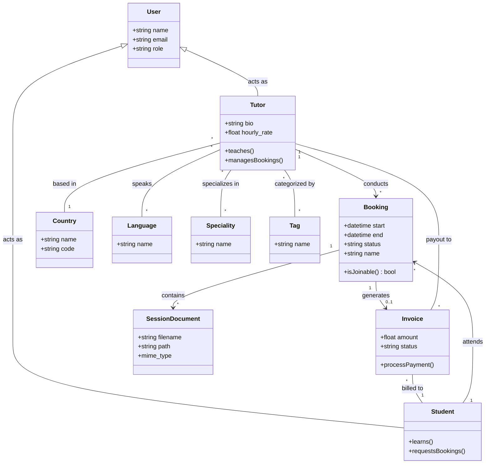

### Domain Model:
- Both `Tutor` and `Student` are specific roles of a `User`.
- A `Tutor` **conducts** a `Booking` and **specializes in** various subjects.
- A `Student` **attends** a `Booking` and is **billed** via an `Invoice`.
- A `Booking` **generates** an `Invoice` and **contains** `SessionDocuments` for learning materials.
- A `Tutor` **speaks** multiple `Languages` and is **categorized by** `Tags`.
- A `Tutor` is **based in** a `Country`.
- An `Invoice` is **billed to** a `Student` and represents a **payout to** a `Tutor`.

